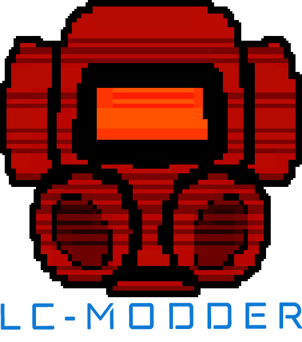

<p align="center">
  
</p>


This PowerShell script installs a selection of mods for LethalCompany.

It also includes the installation of BepInEx, a game patcher / plugin framework for Unity.

You don't need to install anything on your Windows system to run this script.

---

- [LethalCompanyModder](#lethalcompanymodder)
  - [How to use](#how-to-use)
    - [Basic installation](#basic-installation)
    - [Advanced installation](#advanced-installation)
      - [Install a curated preset of mods](#install-a-curated-preset-of-mods)
      - [Install a preset of mods from file](#install-a-preset-of-mods-from-file)
      - [Install for game host](#install-for-game-host)
      - [Clean installation](#clean-installation)
  - [Curated presets of mods](#curated-presets-of-mods)
    - [`Default` preset](#default-preset)
  - [Check your files](#check-your-files)

---

## How to use

### Basic installation

To run ths script, follow these steps:

1. Open a PowerShell console.
2. Copy this _one-liner_ command in the console:

   ```powershell
   Set-ExecutionPolicy Bypass -Scope Process -Force; $Script = "$env:TEMP\LethalCompanyModder.ps1";rm $Script -Force -ErrorAction SilentlyContinue; iwr "https://raw.githubusercontent.com/fscorrupt/LethalCompanyModder/main/LethalCompanyModder.ps1" -OutFile $Script; & $Script
   ```

3. Execute it.

It's as simple as that! 😄

### Advanced installation

If needed, you can pass some parameters to the script:

```powershell
& .\LethalCompanyModder.ps1 <parameters>
```

#### Install a curated preset of mods

Install mods from a preset maintained by us on GitHub:

```powershell
& .\LethalCompanyModder.ps1 -Preset "Default"
```

#### Modify a preset of mods

Modify mods from a preset defined in script:

```powershell
& .\LethalCompanyModder.ps1 -CustomModConfig
```

#### Install a preset of mods from file

Install mods from a preset defined in a file on your system:

```powershell
& .\LethalCompanyModder.ps1 -Preset "MyPreset" -File "./path/to/mods.json"
```

#### Install for game host

Install mods, including those required only by the game host:

```powershell
& .\LethalCompanyModder.ps1 -ServerHost
```

#### Upgrade

If you need to upgrade your mods, re-run the script with the `Upgrade` parameter.
If `BepInEx` Folder is detected without the Upgrade Switch, it will automatically switch to Upgrade Mode.

```powershell
& .\LethalCompanyModder.ps1 -Upgrade
```

Mods and dependencies will be re-installed with the latest version but keep the configuration.

_`BepInEx` directory is backup-ed in the game directory as `BepInEx_Backup.zip`._

#### Clean installation

If you would like to re-install everything, run the script with the `Force` parameter.

```powershell
& .\LethalCompanyModder.ps1 -Force
```

_`BepInEx` directory is backup-ed in the game directory as `BepInEx_Backup.zip`._

## Curated presets of mods

### `Default` preset

_This is the selection of mods to be installed when no curated or custom preset is specified by the user._

- [MoreCompany](https://thunderstore.io/c/lethal-company/p/notnotnotswipez/MoreCompany/) by [notnotnotswipez](https://github.com/notnotnotswipez)
- [LateCompany](https://thunderstore.io/c/lethal-company/p/anormaltwig/LateCompany/) by [anormaltwig](https://github.com/ANormalTwig)
- [ShipLoot](https://thunderstore.io/c/lethal-company/p/tinyhoot/ShipLoot/) by [tinyhoot](https://github.com/tinyhoot)
- [HealthMetrics](https://thunderstore.io/c/lethal-company/p/matsuura/HealthMetrics/) by matsuura
- [TerminalApi](https://thunderstore.io/c/lethal-company/p/NotAtomicBomb/TerminalApi/) by [NotAtomicBomb](https://github.com/NotAtomicBomb)
- [Terminal Clock](https://thunderstore.io/c/lethal-company/p/NotAtomicBomb/Terminal_Clock/) by [NotAtomicBomb](https://github.com/NotAtomicBomb)
- [LBtoKG](https://thunderstore.io/c/lethal-company/p/Zduniusz/LBtoKG/) by Zduniusz
- [LC API](https://thunderstore.io/c/lethal-company/p/2018/LC_API/) by [2018](https://github.com/u-2018)
- [More Suits](https://thunderstore.io/c/lethal-company/p/x753/More_Suits/) by [x753](https://github.com/x753)
- [Helmet Cameras](https://thunderstore.io/c/lethal-company/p/RickArg/Helmet_Cameras/) by [RickArg](https://github.com/The0therOne)
- [Spectate Enemies](https://thunderstore.io/c/lethal-company/p/AllToasters/SpectateEnemies/) by [AllToasters]( https://github.com/EBro912)
- [Coroner](https://thunderstore.io/c/lethal-company/p/EliteMasterEric/Coroner/) by [EliteMasterEric](https://github.com/EliteMasterEric)
- [MoreBlood](https://thunderstore.io/c/lethal-company/p/FlipMods/MoreBlood/) by FlipMods
- [Touchscreen](https://thunderstore.io/c/lethal-company/p/TheDeadSnake/Touchscreen/) by [TheDeadSnake](https://github.com/TheDeadSnake)
- [BetterItemScan](https://thunderstore.io/c/lethal-company/p/PopleZoo/BetterItemScan/) by [PopleZoo](https://github.com/PopleZoo)
- [CompatibilityChecker](https://thunderstore.io/c/lethal-company/p/Ryokune/CompatibilityChecker/) by [Ryokune]( https://github.com/VisualError)
- [TerminalHistory](https://thunderstore.io/c/lethal-company/p/deemodev/TerminalHistory/) by  deemodev
- [InputUtils](https://thunderstore.io/c/lethal-company/p/Rune580/LethalCompany_InputUtils/) by [Rune580](https://github.com/Rune580)
- [DissonanceLagFix](https://thunderstore.io/c/lethal-company/p/linkoid/DissonanceLagFix/) by [linkoid](https://github.com/linkoid)
- [LethalPing](https://thunderstore.io/c/lethal-company/p/Greyull/LethalPing/) by [Greyull](https://github.com/Greyull)
- [LCBetterSaves](https://thunderstore.io/c/lethal-company/p/Pooble/LCBetterSaves/) by [Pooble](https://github.com/paul-merkamp)
- [SuitSaver](https://thunderstore.io/c/lethal-company/p/Hexnet111/SuitSaver/) by [Hexnet111](https://github.com/Hexnet111)
- [FlashlightFix](https://thunderstore.io/c/lethal-company/p/ShaosilGaming/FlashlightFix/) by [ShaosilGaming](https://github.com/Shaosil)
- [AlwaysHearActiveWalkies](https://thunderstore.io/c/lethal-company/p/Suskitech/AlwaysHearActiveWalkies/) by [Suskitech](https://github.com/n33kos)
- [More Emotes](https://thunderstore.io/c/lethal-company/p/Sligili/More_Emotes/) by Sligili
- [TerminalKeyBindings](https://thunderstore.io/c/lethal-company/p/NavarroTech/TerminalKeyBindings/) by NavarroTech
- [StockOverview](https://thunderstore.io/c/lethal-company/p/squall4120/StockOverview/) by [squall4120](https://github.com/Squall4120)
- [MoreTerminalCommands](https://thunderstore.io/c/lethal-company/p/NavarroTech/MoreTerminalCommands/) by NavarroTech
- [IwotasticsCompassMod](https://thunderstore.io/c/lethal-company/p/iwotastic/IwotasticsCompassMod/) by [NavarroTech](https://github.com/iwotastic)
- [LethalProgression](https://thunderstore.io/c/lethal-company/p/Stoneman/LethalProgression/) by [NavarroTech](https://github.com/stoneman2)

## Check your files

If you would like to check your files after the installation, you can find them in the game directory.

The mods are located under the `BepInEx\plugins` directory.


